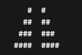

# Mario Pyramid (C Project)

## Description
This program prints a double pyramid pattern using `#` characters based on a user-defined height (1 to 8).

## How it works
- User enters a number between 1 and 8
- Program validates input
- Prints two mirrored pyramids separated by spaces

## Example Output
For height = 4:

## Concepts Used
- Loops (for, do-while)
- Functions
- Input validation
- Basic C formatting

## Author
Sherif Khater
